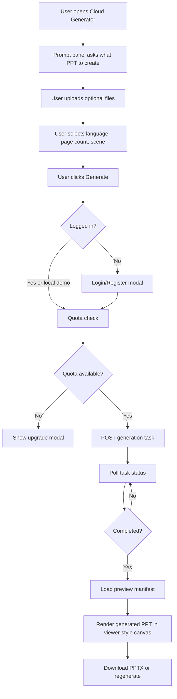

# Cloud Generator Frontend PRD

Date: 2026-06-03
Status: Draft for review
Scope: Frontend product flow, preview contract, and implementation plan for the PPT Master Cloud Generator MVP.

## Purpose

Build a focused PPT generation workbench for PPT Master. The page should feel like a creation entry point, not an operations dashboard. Users provide a prompt and optional reference files, generate a PPTX, then preview the generated deck using the existing `viewer.html` slide-viewer style.

The current requirement is generation-only. Editing is explicitly out of scope.

## Latest Product Decision

Use the first generated homepage as the product entry page and use `cloud-generator-flow-demo.html` as the baseline workbench interface.

The formal implementation target is:

- `index.html`: homepage, language selection, login/register entry, membership/upgrade entry, marketing/product introduction
- `cloud-generator.html`: generation-only workbench rebuilt from the current `cloud-generator-flow-demo.html` prototype
- `viewer.html`: visual reference for generated PPT preview behavior and styling

Workbench constraints from the latest review:

- no editing mode or edit controls
- no login/register UI inside the workbench
- language switching is handled before entering the workbench
- left rail actions are: new workspace, history, saved templates
- lower-left avatar remains visible in the workbench
- uploaded files are listed only; no upload preview
- generated PPT preview is required after generation
- download button is disabled before generation completes and enabled after completion
- generation progress, backend stage updates, and any clarification dialogue appear inside the same conversation area
- task ID is shown as small metadata after generation, not as a separate copy button

## Product Direction

The target UI should follow a PPT creation workbench pattern:

- narrow left navigation rail
- large central canvas for empty state and generated PPT preview
- right-side creation panel for prompt, file input, language, brief settings, and generation action
- lightweight membership/quota indicator only, if needed
- no upload-stage document preview
- generated deck preview only after task completion

This replaces the current heavy three-column task-console direction.

## Membership And Payment Direction

Commercial membership should use one shared account and entitlement system, not two separate frontend codebases.

Recommended regional entry model:

- China entry: a China-friendly domain such as `ppt.aigcstory.cn` or `cn.aigcstory.site`, defaulting to Chinese, CNY, and Alipay/WeChat Pay.
- Global entry: `ppt.aigcstory.site`, defaulting to English, USD, and Paddle or Stripe.
- Both entries load the same frontend bundle and the same backend account system. The frontend selects `region`, `currency`, `payment_provider`, default language, and policy links from `window.location.hostname`.

Membership should remain Free / Pro / Team for the first paid version, but quota should move from raw generation counts toward credits. Credits make page count, AI images, narrated PPTX, and future video export easier to price consistently.

Implementation notes:

- Keep current local checkout only for private testing.
- Add real payment providers behind the existing billing checkout/webhook contract.
- Store users, plans, credits, orders, payment status, and webhook reconciliation in one backend data model.
- Do not fork the workbench frontend for China/global; fork configuration and payment provider only.
- Before China production payment, prepare ICP/compliance, merchant accounts, privacy policy, terms, refund policy, and invoice/refund handling.

## Current System Review

### Existing Backend Flow

Current API server: `skills/ppt-master/scripts/cloud_generator/api_server.py`.

Current endpoints:

- `GET /health`
- `POST /generation-tasks`
- `GET /generation-tasks/{task_id}`
- `GET /generation-tasks/{task_id}/download`

Current create-task payload accepts:

- `brief` or `brief_path`
- `source_text` or `source_path`
- optional `job_id`
- optional `max_attempts`

Current response includes:

- `task_id`
- `status`
- `store`
- `status_url`
- `download_url`

Current status response includes:

- `status`
- timestamps
- events
- `output_path` when completed
- `generation_report_path` in Postgres mode when completed
- errors when failed

Current download response returns local metadata:

- `task_id`
- `download_url: null`
- `local_path`
- `size_bytes`

### Existing Viewer Flow

Current viewer: `viewer.html`.

Viewer currently reads `examples/examples.json`, then displays a selected project with:

- `project.folder`
- `project.slides[]`
- each slide has a `file`
- main slide is rendered through `<object data="...svg" type="image/svg+xml">`
- thumbnail list uses the same SVG files
- page navigation, fullscreen overlay, title/description are already solved

This is the right visual and interaction style for generated PPT preview.

### Current Frontend Prototype State

Current `cloud-generator.html` already has:

- i18n scaffold for English and Chinese
- API base setting
- brief form and JSON mode
- file upload list and file preview
- task status strip
- task history panel
- event list
- localStorage task persistence

This conflicts with the updated product direction because it feels like a backend console and previews uploaded files. It should be simplified.

## Conflicts And Logic Gaps

### 1. Upload Preview Is No Longer Required

Current frontend previews text, image, and PDF uploads. Updated requirement says uploaded files do not need preview. They should only appear as an input list.

Resolution:

- remove upload preview panel
- keep file names, sizes, and remove buttons
- text-like files may still be read into `source_text` for the local prototype
- non-text files should be listed only until backend upload support exists

### 2. Generated PPT Preview Has No Backend Contract Yet

Current backend can return a completed PPTX path, but it cannot return slide previews. Browser preview needs SVG/PNG slide assets or a manifest.

Resolution:

- add a planned preview contract before implementing real preview
- frontend can initially support mock/demo manifest for visual validation
- backend should later expose viewer-compatible preview data

### 3. `viewer.html` Uses Static Example Paths

`viewer.html` assumes slides live under `examples/{folder}/{slide.file}`. Generated jobs live under `/tmp/...` and are not web-served by the API today.

Resolution:

- do not point directly to `/tmp` paths from browser
- introduce API-served preview asset URLs, or copy generated preview assets to a web-served directory
- manifest should contain browser-safe URLs, not local filesystem paths

### 4. Upload Files Are Not Actually Persisted By API

Current API accepts `source_text` and `source_path`. Browser file uploads cannot provide server-readable local paths. Text files can be merged into `source_text`, but PDF/DOCX/image files need a real upload/materialization endpoint.

Resolution for frontend MVP:

- text files: merge into `source_text`
- binary files: list as attached but show a note if not supported by current local API
- future API: multipart upload or base64 `materials[]`

### 5. Login And Membership Now Have A Local Backend Contract

The local JSON API now supports email/password registration, login, membership lookup, session tokens, quota deduction, and user-owned task history. This is enough for local/private testing, but it is not a production identity or billing system yet.

Resolution:

- homepage login/register calls the local auth API and stores the returned session token
- workbench sends `X-PPT-Master-Session` with task, history, preview, and download requests
- local JSON tasks are owner-scoped; Postgres queue mode still needs matching owner fields
- production still needs hardened password storage, payment integration, logout/session expiry, and team membership

### 6. Existing CORS Patch Is Compatible

The added CORS and `OPTIONS` support is needed for the static page to call the local API from `http://127.0.0.1:8000`.

Resolution:

- keep CORS support for local prototype
- production should restrict allowed origins

## Target User Journey



## Wireframe Draft

### Empty State

```text
┌──────┬──────────────────────────────────────────────┬────────────────────────────┐
│ Logo │                                              │ Free · 2 left   Login      │
│  +   │          No PPT generated yet                 ├────────────────────────────┤
│  ⏱   │          Upload materials or enter a prompt   │ Create                     │
│  ☆   │          to generate an editable PPTX.        │                            │
│      │                                              │ What PPT do you need?      │
│      │                                              │ ┌────────────────────────┐ │
│      │                                              │ │ Enter requirements...  │ │
│      │                                              │ └────────────────────────┘ │
│      │                                              │ [Upload files]             │
│      │                                              │ report.pdf                 │
│      │                                              │ notes.md                   │
│      │                                              │                            │
│      │                                              │ Language  Pages  Scene     │
│      │                                              │ [Generate PPT]             │
└──────┴──────────────────────────────────────────────┴────────────────────────────┘
```

### Running State

```text
┌──────┬──────────────────────────────────────────────┬────────────────────────────┐
│ Nav  │          Generating your PPT...              │ Task status                │
│      │          queued -> running -> generating     │                            │
│      │          Progress events appear here         │ Latest event               │
│      │                                              │ Worker is drafting slides  │
└──────┴──────────────────────────────────────────────┴────────────────────────────┘
```

### Completed State

```text
┌──────┬──────────────────────────────────────────────┬────────────────────────────┐
│ Nav  │  ┌────────────────────────────────────────┐  │ Generated                  │
│      │  │ Main slide preview using viewer style   │  │                            │
│      │  └────────────────────────────────────────┘  │ [Download PPTX]            │
│      │  [Slide 1] [Slide 2] [Slide 3] [Slide 4]     │ [Regenerate]               │
│      │                                              │ task ID: api_xxx           │
└──────┴──────────────────────────────────────────────┴────────────────────────────┘
```

## Frontend Requirements

### Layout

- Use a three-zone workbench: left rail, center preview canvas, right creation panel.
- Do not show editing controls.
- Do not show login/register controls inside the workbench.
- Do not show uploaded file previews.
- Keep right panel width stable on desktop.
- Collapse to a single-column flow on mobile: top account bar, prompt panel, preview area, recent task controls.
- Left rail buttons map to new workspace, history, and saved templates.

### Upload Input

- Allow multiple reference files.
- Show only file name, size, and remove action.
- For text-like files, merge content into `source_text` for local prototype submission.
- For binary files, include metadata in payload notes until upload API exists.
- Do not render image/PDF/text previews before generation.

### Prompt And Settings

- Prompt textarea is the primary input.
- Settings are secondary and compact: language, page count, scene type, audience, tone/style.
- Keep JSON mode hidden or remove it from primary UI. If kept, expose only as a developer/debug affordance.
- Conversation responses, clarification prompts, and generation status events must appear in the same dialogue area.
- Do not add a separate status text box below the composer.

### Generated Preview

Use `viewer.html` style:

- main slide canvas
- thumbnail strip or sidebar
- page counter
- fullscreen preview optional
- slide title optional
- generated report optional

Do not implement slide editing.

### Login/Register UI

Homepage v0:

- login/register entry stays on `index.html`
- modal or dedicated auth section
- email/password form
- login first, auto-register for local test accounts when needed
- session token is stored in localStorage for the prototype
- after login, user enters `cloud-generator.html`

Workbench v0:

- show avatar/session state only
- no login/register form
- no language switcher

Implemented local API contract:

- `POST /auth/register`
- `POST /auth/login`
- `GET /membership`

Still future:

- `POST /auth/logout`
- `GET /me`
- production password hashing and session expiry

### Membership UI

Frontend v0:

- show membership badge in top/right area
- mock plans in modal: Free, Pro, Team
- quota display near Generate button
- upgrade button opens membership modal only

Suggested plan model:

| Plan | Limit | Max pages | Key rights |
| --- | --- | --- | --- |
| Free | 3/day | 8 | Basic generation |
| Pro | 100/month | 30 | no watermark, preview history |
| Team | shared quota | 50 | brand templates, members |

Implemented local API contract:

- `GET /membership`

Future API contract:

- `GET /usage`
- `POST /billing/checkout`

## Preview Manifest Contract

Recommended new endpoint:

`GET /generation-tasks/{task_id}/preview`

Response:

```json
{
  "task_id": "api_pg_demo",
  "status": "completed",
  "title": "Q3 Business Review",
  "description": "Generated from uploaded source material",
  "format": "svg",
  "folder": "/generation-tasks/api_pg_demo/assets/preview",
  "slides": [
    {
      "index": 1,
      "title": "Executive Summary",
      "desc": "High-level Q3 performance",
      "file": "slide-001.svg",
      "url": "/generation-tasks/api_pg_demo/assets/preview/slide-001.svg"
    }
  ],
  "pptx_download_url": "/generation-tasks/api_pg_demo/download",
  "generation_report_path": "/tmp/.../generation_report.json"
}
```

Frontend should prefer `slide.url`. `folder + file` can be kept for compatibility with `viewer.html` style.

## Backend Implications

To fully support generated previews, backend/worker should add one of these:

### Option A: SVG Preview

- Generate SVG slides or convert PPTX slides to SVG.
- Best match for existing `viewer.html`.
- Reuses `<object data="...svg">` pattern.

### Option B: PNG Preview

- Convert PPTX slides to PNG.
- Simpler browser rendering.
- Less editable-looking than SVG, but reliable.

Recommended MVP: Option A if existing PPT Master render pipeline already produces SVG; otherwise Option B for faster proof.

Backend also needs asset serving:

- `GET /generation-tasks/{task_id}/assets/preview/{file}`

## Implementation Phases

### Current Implementation Snapshot

As of the latest local prototype pass, the MVP flow has moved beyond the original static mock:

- `cloud-generator.html` is the active workbench and keeps the no-edit generation-only direction.
- Brief Assistant uses the configured LLM to converse naturally, produce an outline, recommend whether images are useful, and wait for user confirmation before generation.
- The backend exposes task creation, polling, real SVG preview, preview asset serving, PPTX download, task history, template listing, and PPTX template import.
- The worker can run the automated PPT Master pipeline: source materialization, Strategist, image manifest/fallback image search, Executor SVG generation, quality check, finalize, backup, animation config, optional audio, and editable PPTX export.
- Generated task failures now surface explicit `failure_analysis` and the frontend keeps download/preview disabled when a task fails.
- The generator now reads the original PPT Master chart/infographic catalog and can carry `chart_template` choices into slide generation.
- Local JSON task status now records operational metrics such as duration, generated page count, page attempts, and PPTX size. Postgres task listing is implemented for production-shaped history.
- Local auth/quota is implemented for private testing: homepage login/register calls the backend, workbench sends session tokens, generation deducts quota, and JSON history/status/preview/download enforce task ownership.
- Local/private-beta account contract now includes session TTL (`PPT_MASTER_SESSION_TTL_SECONDS`), `POST /auth/logout`, and Team-plan member management through `GET /team`, `POST /team/invite`, and `POST /team/remove`.
- Failed or cancelled local JSON tasks can be retried through `POST /generation-tasks/{id}/retry`; retry reuses the same materials and does not deduct quota again.
- Failed/cancelled tasks now expose user-visible retry controls in the workbench: safe retry can cap pages and selectively disable image generation, narration, SVG snapshot, and animations, while advanced users can retry with original settings.
- LLM calls now support profile-based model/provider routing for `brief`, `strategy`, `slide`, and `slide_fallback`; executor attempts record `model_profile` and task metrics summarize model profile usage.
- Artifact manifest contract is implemented locally through `GET /generation-tasks/{id}/artifacts`, returning browser-safe URLs, content types, sizes, and storage mode for PPTX, SVG previews, and audio files.
- Postgres queue schema/helper/API now carry `owner_user_id` and `quota_debited`, support owner-filtered history, and apply owner checks to Postgres status/download/preview/artifact routes.
- Source material handling now blocks localhost/private/link-local/reserved URL imports by default and rejects unsupported uploaded file suffixes before saving browser-uploaded materials.
- Homepage auth uses the local login API with `auto_register` for private testing, avoiding a failed-login console error while still returning a real session token.
- Executor attempts now record both `model_profile` and resolved `model_name`; task metrics summarize model names to support cost analysis.
- `scripts/cloud-generator-smoke.py` provides a repeatable mock regression covering auth/quota, owner checks, generation, artifact manifest, retry, and source-material security checks.
- `scripts/cloud-generator-regression-matrix.py` provides a no-cost mock scenario matrix for business weekly report, academic defense, product intro, market research, file-to-PPT, template parameters, image generation, and audio export.
- Optional S3-compatible artifact storage is implemented through `PPT_MASTER_STORAGE_MODE=s3`, supporting Tencent COS, Cloudflare R2, MinIO, and AWS S3 via `boto3`.
- Remote S3/COS/R2 artifact cleanup is available through `scripts/cleanup-cloud-generator-artifacts.py`, using dry-run by default and `--apply` for deletion.
- Retry now applies a safe fallback policy by default: image generation, narration, SVG snapshots, and animations are disabled before rerun, and retry backup directories are collision-safe.
- Preview manifests now expose generated/searched image assets with attribution metadata, plus narration audio assets; the workbench renders a compact image/audio asset summary after generation.
- Workbench provider status UI is backed by `GET /provider-status`, showing configured image backend, image-search fallback, and narration providers without exposing secrets.
- Local billing and usage contracts are implemented for private testing through `POST /billing/checkout`, `POST /billing/webhook`, and `GET /usage`; checkout can auto-complete locally, the workbench membership modal can switch Free/Pro/Team, and usage summarizes tasks, page attempts, generated pages, PPTX bytes, model names, and estimated cost.
- Deployment maintenance now includes `scripts/cleanup-cloud-generator-jobs.py`, a dry-run-first cleanup tool for old local job workspaces.
- Uploaded materials now get basic server-side file signature checks and can run an optional ClamAV-compatible scan through `PPT_MASTER_CLAMSCAN_BIN`.
- Task metrics now count generated image/audio assets and can include configurable page/image/audio unit-cost estimates in task metrics and `/usage`.
- Cloud Generator subprocess logs and failure diagnostics now apply best-effort secret redaction for API keys, bearer tokens, query tokens, and configured secret environment values.
- `scripts/check-cloud-generator-readiness.py` can audit public/private-beta configuration for access token strength, auth requirement, S3/COS storage, ClamAV scanner, cost telemetry, and LLM credentials.

### Remaining Alignment And Commercialization Backlog

P0 items are required before inviting broader external testers:

- **Production account contract:** replace local JSON auth with production identity, password reset/email verification, provider-backed sessions, and team invitation delivery.
- **Object storage provider hardening:** add provider-specific access audit checks and CDN/cache invalidation guidance.
- **Failure recovery fallback policy:** add richer retry diagnostics that explain which setting caused the previous failure when detectable.
- **Payment provider integration:** connect provider-specific API calls for invoices, refunds, and chargeback handling.
- **Security hardening:** add production-grade malware scanning policy and external access monitoring.
- **Cost telemetry:** split image/audio cost by backend provider and reconcile provider invoices against task-level estimates.
- **Production identity contract:** replace local JSON auth with production identity, password reset/email verification, and provider-backed sessions.

P1 items improve quality and conversion after the private beta baseline is reliable:

- **Audio UX:** in-workbench voice selection and clearer export behavior for narrated decks.
- **Image UX:** safe replacement controls and provider-specific configuration editing.
- **Regression matrix:** add visual diff/quality thresholds on top of the current mock scenario matrix.

Deferred by product decision:

- Template marketplace, template favorites/team libraries, and chart/template quality scoring are out of the current commercialization scope.

### Immediate Next Development Order

1. Done: add backend preflight validation and expose limits in `POST /generation-tasks` errors.
2. Done: surface preflight failures naturally in the workbench dialogue.
3. Done: add lightweight task metrics in task metadata without crowding the workbench.
4. Done: add local auth, membership lookup, quota deduction, session-aware frontend requests, user-scoped JSON history, and owner checks for JSON status/preview/download/assets.
5. Done: add retry endpoint and frontend retry behavior for failed/cancelled JSON tasks without duplicate quota deduction.
6. Done: add model/provider routing rules: inexpensive model for brief/strategy, stronger fallback for failed SVG pages.
7. Done: add local artifact manifest and browser-safe artifact URL contract.
8. Done: add Postgres owner/quota fields to match the JSON local prototype.
9. Done: add object-storage provider implementation for Tencent COS/R2/S3-compatible storage.
10. Done: block SSRF-prone URL imports and reject unsupported uploaded file suffixes.
11. Done: record executor model names in generation reports and task metrics.
12. Done: add a repeatable no-cost Cloud Generator smoke test script.
13. Done: add retry safe fallback policy and collision-safe retry backups.
14. Done: expose image assets in preview/artifact manifests and render image/audio asset summaries in the workbench.
15. Done: add local Free/Pro/Team membership plan switching for private testing.
16. Done: add dry-run-first local job cleanup script and deployment docs.
17. Done: replace local plan switching calls with local billing checkout/webhook contract and add usage summary endpoint.
18. Done: add upload file signature checks, optional ClamAV scan hook, image/audio asset counts, and configurable cost estimates.
19. Done: add best-effort secret redaction for Cloud Generator logs and diagnostics.
20. Done: add deployment readiness checker for auth, storage, scanner, cost, and LLM configuration.
21. Done: add local/private-beta logout, session TTL, and Team member management contract.
22. Done: add user-visible advanced retry fallback controls and backend option support.
23. Done: add no-cost regression matrix for the main commercial generation scenarios.
24. Done: add dry-run-first S3/COS/R2 artifact cleanup script.
25. Done: add provider status endpoint and workbench image/audio provider configuration visibility.
26. Done: persist task-level LLM token usage, aggregate it in `/usage`, and add configurable token-cost estimates.
27. Done: add provider-aware hosted checkout URL contract and optional webhook HMAC verification.
28. Done: add Team invitation accept links plus SMTP/outbox delivery contract.
29. Next: add production identity adapter for password reset, email verification, and provider-backed sessions once the identity provider is selected.
30. Next: add provider-specific payment implementation for invoices, refunds, chargebacks, and payment-provider dashboard reconciliation.

### Latest Development Notes

- Server preflight now blocks over-limit tasks before materializing inputs or creating queue records.
- Default local limits: 30 pages, 5 attempts, 12 files, 30MB per file, 60MB total upload, 10 URLs, 180k source characters, image generation up to 12 pages, audio up to 20 pages.
- Workbench fetch handling tags HTTP 400 preflight responses as task-parameter failures instead of backend connectivity failures.
- Browser smoke verified that a 35-page request returns `Task preflight failed: page_count 35 exceeds limit 30` with `error.code = preflight`.
- Completed tasks can show compact metrics below the task ID, such as page count, PPTX size, duration, and page attempt count when the backend provides them.
- Auth/quota smoke verified that `PPT_MASTER_REQUIRE_AUTH=1` blocks anonymous task creation, registration returns a session, generation deducts Free quota from 3 to 2, and the task stores `owner_user_id`.
- Owner smoke verified that another session cannot read, preview, or list someone else's JSON task.
- Retry smoke verified that a forced failed task can be requeued and completed through `/generation-tasks/{id}/retry` without a second quota deduction.
- Model routing smoke verified that generated page attempts record `model_profile` and task metrics include `model_profiles`, e.g. `{"slide": 4}` for a four-page mock deck.
- Artifact smoke verified that `/artifacts` returns one PPTX plus four SVG preview artifacts for a completed four-page mock deck.
- Postgres parity compile check verified schema/helper/API changes for owner/quota fields and owner-filtered task listing.
- Security smoke verified that localhost/private URLs are blocked, `https://example.com` normalizes successfully, and unsupported `.exe` uploads are rejected before persistence.
- Browser auth smoke verified that homepage login stores a real session token and the workbench reads the same session to show Free quota without console errors.
- Model-name telemetry smoke verified that `LLM_MODEL_SLIDE=cheap-slide` appears in task metrics as `model_names: {"cheap-slide": 4}`.
- Regression script smoke passed with a mock task producing 6 artifacts and quota `used=1`, confirming retry does not double debit quota.
- Latest regression script smoke passed with a mock task producing 6 artifacts, including a generated image asset, and confirmed retry fallback disables high-risk options.
- Deployment readiness doc added at `docs/deployment/production-lite.md` for 2-core private beta, Nginx reverse proxy, and Tencent COS/R2/S3 storage configuration.
- Browser membership smoke verified homepage login, workbench plan switch to Pro, and quota refresh to `100/100` without console errors.
- Cleanup script smoke verified dry-run behavior for an empty jobs directory.
- Billing/usage smoke verified local checkout upgrades to Pro, generation consumes quota once, and `/usage` reports completed tasks, page attempts, model names, and PPTX bytes.
- Browser billing smoke verified checkout upgrade to Team and quota refresh to `500/500` without console errors.
- Security/cost pass added executable/PDF/Office signature checks, optional `PPT_MASTER_CLAMSCAN_BIN`, and `/usage` totals for image/audio asset counts plus configurable unit-cost estimates.
- Log redaction pass added masking for API keys, bearer tokens, query tokens, and secret-like environment values before writing Cloud Generator subprocess logs or tracebacks.
- Readiness checker added to catch weak/missing public-token, disabled auth, incomplete S3/COS storage, missing scanner, missing cost telemetry, and absent LLM credentials before sharing a URL.
- Account-contract smoke verified local checkout to Team creates a team, invite/remove member APIs work, and `POST /auth/logout` revokes the session so `/usage` returns 401 afterward.
- Retry-control smoke verified backend fallback still caps pages while preserving image/audio/snapshot/animation settings when advanced retry options ask to keep them enabled.
- Regression matrix passed across eight mock scenarios: business weekly report, academic defense, product intro, market research, file-to-PPT, template parameters, image generation, and audio export.
- Remote artifact cleanup script added for S3-compatible storage; dry-run mode reports candidate objects before `--apply` deletes them.
- Provider-status smoke verifies `/provider-status` exposes image/audio sections and confirms the default edge narration backend is available; browser UI exposes the status in a workbench modal.
- Token telemetry now writes `llm_usage.jsonl` per task, summarizes calls/tokens by model and profile in task metrics, and includes user-level token totals plus token cost estimates in `/usage`.
- Billing checkout now supports non-local providers through `PPT_MASTER_PAYMENT_PROVIDER` and `PPT_MASTER_PAYMENT_CHECKOUT_URL_TEMPLATE`; webhook completion can optionally require shared-secret and HMAC verification.
- Billing checkout now has explicit Alipay provider support through `PPT_MASTER_PAYMENT_PROVIDER=alipay` and `PPT_MASTER_ALIPAY_CHECKOUT_URL_TEMPLATE`; the local `alipay-payment-skill`/`alipay-bot` can handle agent-side cashier payment submission and status query once a real Alipay cashier URL or order string is produced by a merchant order service.
- Team invitations now generate accept links and are delivered through SMTP when configured, otherwise they are appended to local `email_outbox` for private-beta testing.
- Product scope update: template marketplace and chart/template quality evaluation are deferred; current commercial focus is real payment, production identity/email invitation, cost telemetry, security, and deployment reliability.

### Phase 0: Lock The Prototype Direction

- Treat `cloud-generator-flow-demo.html` as the accepted workbench prototype.
- Keep the first generated homepage as the accepted product entry direction.
- Remove outdated PRD references to edit mode, workbench login, upload preview, and copy task ID button.
- Confirm the workbench user journey with one clickable local HTML flow.

### Phase 1: Homepage To Workbench Navigation

- Keep `index.html` as the homepage.
- Route the primary CTA from homepage to the formal workbench page.
- Keep language switch and login/register on the homepage.
- Pass selected language/session state to the workbench through localStorage or query params for the prototype.
- Keep membership/upgrade entry visible on homepage; workbench may only show compact quota state.

### Phase 2: Workbench Shell Refactor

- Rebuild `cloud-generator.html` from the accepted `cloud-generator-flow-demo.html` style.
- Remove upload preview panel.
- Keep workbench text clean and generation-focused.
- Keep CORS patch.
- Keep simple task polling.
- Add compact mock membership/quota badge if useful.
- Add generated-preview area with mock slide manifest.
- Keep task ID as small metadata after generation.

### Phase 3: Viewer-Style Generated Preview

- Extract minimal viewer logic from `viewer.html` into `cloud-generator.html` or a small shared script.
- Render preview manifest with main slide and thumbnails.
- Use mock preview data when no backend preview exists.
- When `/preview` exists, load real manifest.

### Phase 4: Backend Preview Contract

- Add `/generation-tasks/{id}/preview`.
- Add preview asset serving route.
- Update worker to produce SVG or PNG preview assets.
- Add status response field for preview availability.

### Phase 5: Auth/Membership Backend

- Done for local JSON/private testing: replace localStorage mock auth with API auth.
- Done for local JSON/private testing: enforce quota before task creation.
- Done for local JSON/private testing: add user-owned task history and owner checks.
- Done: add Postgres owner/quota parity at schema/helper/API level.
- Next: add plan upgrade/payment flow.

## Acceptance Criteria For Next Frontend PR

- Homepage keeps the first generated visual direction.
- Homepage can switch English/Chinese and provide login/register entry.
- Homepage CTA opens the generation workbench.
- Workbench matches the accepted `cloud-generator-flow-demo.html` structure.
- Workbench does not include login/register or language switching controls.
- User can see avatar and optional compact quota state in the workbench.
- User can upload multiple files and see file names only.
- User can enter prompt/settings and submit a task to existing local API.
- Running task state is visible inside the dialogue area.
- Completed/mock task can render PPT preview in viewer style.
- Download PPTX action still calls existing download endpoint.
- Download PPTX button is disabled before completion and enabled after completion.
- Task ID is shown as small metadata after completion, not as a standalone copy button.
- Left rail supports new workspace, history, and saved templates.
- No edit controls appear anywhere.
- Mobile layout has no horizontal overflow.

## Non-Goals

- No slide editing.
- No uploaded file preview.
- No real payment integration in frontend v0.
- No production-grade auth provider in frontend v0; local JSON auth is for private testing.
- No external object storage until storage abstraction is added.
- No direct browser access to local filesystem paths returned by API.

## Open Questions

1. Should generated preview use SVG first or PNG first?
2. Should account gating block generation in local demo, or only show mock warnings?
3. Should history and saved templates be fully mocked in frontend v0, or only show placeholder modal content?
4. Should the homepage pass selected language to the workbench by query param or localStorage?

## Recommended Decision

Proceed with a rewrite in place for `cloud-generator.html`, using `cloud-generator-flow-demo.html` as the workbench baseline. Keep `index.html` as the homepage entry. Keep the backend CORS patch. Do not change worker/backend preview yet; use a mock viewer-style preview manifest in the frontend shell, then add the real preview API after the UI flow is accepted.
